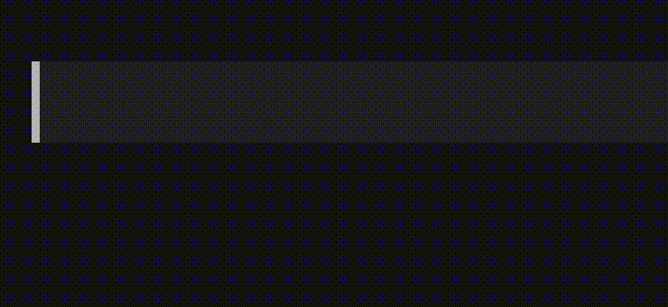
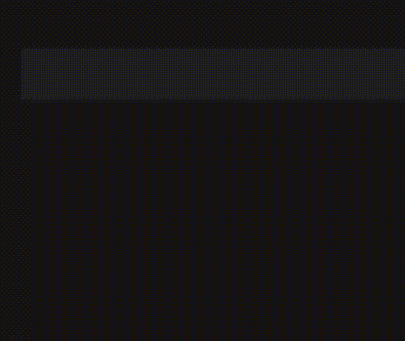

<p align="center">
  
</p>

<h1 align="center">nagi</h1>

<p align="center">
  macOS 向けの、モダンで軽量な日本語 IME — おなじみの変換品質を、<br>
  SwiftUI 製の新しい候補ウィンドウで。
</p>

<p align="center">
  🇯🇵 日本語 ・ <a href="README.md">🇺🇸 English</a>
</p>

<p align="center">
  
  
  
</p>

---

## 目次

- [nagi とは](#nagi-とは)
- [特徴](#特徴)
- [インストール](#インストール)
- [アンインストール](#アンインストール)
- [なぜまた日本語 IME を作るのか](#なぜまた日本語-ime-を作るのか)
- [アーキテクチャ概観](#アーキテクチャ概観)
- [パフォーマンス目標](#パフォーマンス目標)
- [開発](#開発)
- [ライセンス](#ライセンス)

## nagi とは

`nagi` は、Mozc 変換エンジン（Google 日本語入力のオープンソース版コア）を
再利用した macOS 用入力メソッドです。その上に、ネイティブな SwiftUI 製の
候補ウィンドウを乗せています。エンジンはアプリバンドルの中に同梱されて
いるため、別途 Google 日本語入力をインストールする必要はありません。

名前の由来は「凪」— 風がやみ、海面が静まる、あの瞬間のことです。
これがそのまま、目指している入力体験でもあります: 軽く、静かで、
予測可能。

## 特徴

- **フォーカスを奪わない候補ウィンドウ** — 非アクティベートパネルとして
  実装されているため、変換中も入力中のアプリのフォーカスが途切れません

  

- **`:` 絵文字ショートコード検索** — Slack や GitHub と同じ感覚で、
  `:` に続けて英語のキーワードを打つと絵文字を検索できます。Tab で
  全絵文字を一覧表示、直近使った絵文字は候補の先頭に出ます。Google
  日本語入力の OSS 版にはない機能です

  

## インストール

```sh
curl -fsSL https://github.com/nv-leo/nagi/releases/latest/download/install-nagi.sh | bash
```

- 管理者パスワードを一度だけ求められます（`/Library/Input Methods/`が
  システムフォルダのためです）
- 完了後、Nagi が自動的に起動します

> [!IMPORTANT]
> 使い始める前に、一度ログアウトしてログインし直してください。
> システム設定 > キーボード > 入力ソースの表示・メニューバー表示・
> 変換エンジンの起動は、いずれも次回ログイン時にしか反映されません。
> フルの再起動は不要で、ログアウトだけで十分です。これは Google
> 日本語入力など他のサードパーティ製 macOS IME にも共通して必要な
> 一度限りの手順で、`nagi`だけの制約ではありません。

<details>
<summary>なぜ curl ワンライナーなのか</summary>

これは`curl | bash`のワンライナーです。シェルへ流し込む前にスクリプト
の中身を確認したくなるのはもっともです。そのための代替手順
（ダウンロード→確認→実行）を、[`app/README.md`](app/README.md)（英語）
の「Prebuilt download」節に用意しています。

以前の`.dmg`ベースのインストーラーから移行した理由もそこにあります。
要約すると、`nagi`は pre-alpha で未署名・未公証です（有償の Apple
Developer ID がまだないため）。この組み合わせでは`.dmg`は結局
Terminal 操作なしには開けないと判明し、ワンライナーの方が誠実な形
だと判断しました。

</details>

自分でビルドしたい場合は、[`app/README.md`](app/README.md)（英語）に
ソースからのビルド手順があります。

## アンインストール

`Applications`フォルダにある`Uninstall Nagi.app`をダブルクリックして
ください。Nagi は初回起動時に自分でそこへコピーしています。そのため
インストーラー側で別途何かする必要はなく、必要なときにはすでにそこに
あります。確認と管理者パスワードの入力の後、Nagi 本体・バックグラウンド
プロセス・入力ソースのエントリまで、まとめて削除します — Terminal は
不要です。すべて成功した最後に自分自身も削除するので、後片付けする
物は残りません。

> [!NOTE]
> 「日本語」の下に空欄の行が残る場合があります。実害はなく、
> アンインストーラーが再起動を提案します（強制ではありません）。

`install-nagi.sh`自体が途中で失敗した場合、Nagi は一度も起動できず、
アンインストーラーも配置されません。その場合は、Finder で
`/Library/Input Methods/Nagi.app`を手動削除してください。リポジトリを
clone していれば、`scripts/uninstall-ime.sh`も使えます。

ソースからビルドした場合は、`./scripts/uninstall-ime.sh --system`
でファイル・プロセスの削除ができます。詳細は
[`app/README.md`](app/README.md)（英語）参照。

## なぜまた日本語 IME を作るのか

直接名前を挙げる価値がある製品は、ひとつあります。`nagi` は、まさに
それとは別のフロントエンドであることを目指して存在しているからです:
**Google 日本語入力**、macOS 向けの公式な Mozc ベース IME です。`nagi` は
Google 日本語入力とまったく同じ変換エンジン — Mozc — を使っており、
違いは表面の UI だけにあります:

| | Google 日本語入力（公式） | **nagi** |
|---|---|---|
| 変換エンジン | Mozc | Mozc（同梱） |
| 候補 UI | 2010 年代のデザイン | モダン、SwiftUI |
| 追加インストール | — | 不要 |
| 予測可能性 | 高い | 高い |
| メモリ使用量 | 少ない | 少ない |

`nagi` はエンジンより賢くなろうとしているわけではありません。
エンジンは、すでに十分良いものです。目指しているのは、macOS に欠けて
いた、Mozc のためのフロントエンドになることです。

ニューラル／LLM ファーストの変換（Magic Conversions）が目当てなら、
azooKey の方が向いています。`nagi` は Mozc の**フォークではなく**、
upstream の `google/mozc` を追随し、置き換えるのはレンダラーだけです。

## アーキテクチャ概観

（日本語と英字が混在する罫線図は等幅表示が崩れやすいため、英語版と同じ図を掲載しています）

```
┌────────────────────────────────────┐
│ macOS app (Swift, IMKit)           │
│   ┌────────────────────────────┐   │
│   │ IMKInputController         │   │
│   │  → routes keys, commits    │   │
│   └────────────┬───────────────┘   │
│                │                   │
│   ┌────────────▼───────────────┐   │
│   │ Candidate window (SwiftUI) │   │
│   │  NSPanel, non-activating   │   │
│   └────────────┬───────────────┘   │
│                │                   │
│   ┌────────────▼───────────────┐   │
│   │ Mozc IPC client (Swift +   │   │
│   │ SwiftProtobuf)             │   │
│   └────────────┬───────────────┘   │
└────────────────┼───────────────────┘
                 │ Mach IPC
┌────────────────▼───────────────────┐
│ mozc_server (bundled, C++,         │
│ rebranded "NagiConverter")         │
│   converter, dictionary, learning  │
└────────────────────────────────────┘
```

詳細は [docs/architecture.md](docs/architecture.md)、マイルストーン計画は
[docs/roadmap.md](docs/roadmap.md) を参照してください（いずれも英語）。

## パフォーマンス目標

- キー入力 → 候補ウィンドウ描画: 目標 **16 ms 以内**（1 フレーム）、
  上限 **50 ms 以内**。
- 常駐メモリ（アプリ＋同梱の `mozc_server`）: 通常 **150 MB 以下**。
- コールドスタート（ログイン後の最初のキー入力）: 初回描画まで
  **300 ms 以内**。

これらは目標であって約束ではありません。設計上の選択がこの目標を
脅かしていないか気づくために存在しています。

## 開発

Swift↔Mozc IPC の M0 時点の実証実験については
[`poc/README.md`](poc/README.md)（英語）を参照してください。IMKit
アプリ本体のビルド・インストール・`scripts/install-ime.sh` の流れに
ついては [`app/README.md`](app/README.md)（英語）を参照してください。

## ライセンス

Apache License 2.0 — 詳細は [LICENSE](LICENSE) を参照してください。
Mozc の BSD 3-Clause ライセンスとの互換性と、明示的な特許許諾があることから
選定しました。

Mozc 自体は元の BSD 3-Clause ライセンスのままです。同梱している
`mozc_server` バイナリおよび Mozc 由来のコードには、そのライセンス表記が
付されます。
