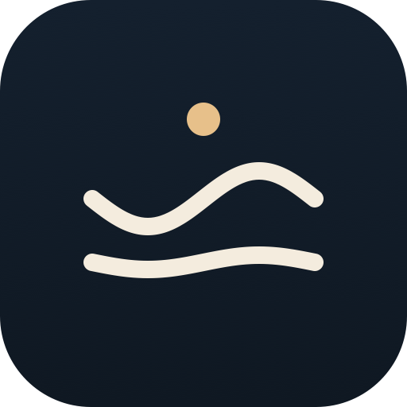

<p align="center">
  
</p>

<h1 align="center">nagi</h1>

<p align="center">
  A modern, lightweight Japanese IME for macOS — the conversion quality you<br>
  already know, in a candidate window that finally looks like it was made this decade.
</p>

<p align="center">
  <a href="README-JP.md">🇯🇵 日本語</a> ・ 🇺🇸 English
</p>

<p align="center">
  
  
  
</p>

---

## Contents

- [What it is](#what-it-is)
- [Install](#install)
- [Why another Japanese IME](#why-another-japanese-ime)
- [Non-goals](#non-goals)
- [Architecture at a glance](#architecture-at-a-glance)
- [Performance targets](#performance-targets)
- [Development](#development)
- [License](#license)

## What it is

`nagi` is a macOS input method that reuses the Mozc conversion engine (the
open-source core of Google 日本語入力) and puts a native SwiftUI candidate
window on top of it. The engine ships inside the app bundle — no separate
Google 日本語入力 install required.

The name is 凪 — the calm, wind-free state of the sea, the moment when the
wind dies down and the water goes still. That is the input experience we
are aiming for: light, quiet, predictable.

## Install

No GitHub Release has been cut yet (`nagi` is pre-alpha) — for now,
building from source is the only option. See
[`app/README.md`](app/README.md) for the full build/install steps; the
gist:

```sh
./scripts/build-dmg.sh   # -> .build-dmg/Nagi-<version>.dmg
```

then drag `Nagi.app` onto the `Input Methods` alias inside the `.dmg`,
open it once (macOS will warn it's from an unidentified developer —
Control-click > Open handles that), and it's ready: no reboot needed to
show up under System Settings > Keyboard > Input Sources. To remove it
later, double-click the `Uninstall Nagi.app` bundled in the same `.dmg`.

Once a Release exists, this section will point at the prebuilt `.dmg`
directly instead.

## Why another Japanese IME

There is one product worth naming directly, because `nagi` exists
specifically to be a different frontend for it: **Google 日本語入力**, the
official Mozc-based IME on macOS. `nagi` runs the exact same conversion
engine — Mozc — so the difference is entirely in the surface:

| | Google 日本語入力 (official) | **nagi** |
|---|---|---|
| Conversion | Mozc | Mozc (bundled) |
| Candidate UI | Legacy (~2010) | Modern, SwiftUI |
| Extra install | — | none |
| Predictability | High | High |
| Memory | Low | Low |

`nagi` is not trying to be smarter than the engine — the engine is already
good. It is trying to be the frontend Mozc has been missing on macOS.

## Non-goals

- **Not** a neural / LLM-first IME. If you want Magic Conversions, use azooKey.
- **Not** an engineer-specialised IME. It should feel right for writers, office
  users, students — anyone typing Japanese.
- **Not** a Mozc fork. We track upstream `google/mozc` and only replace the
  renderer.
- **Not** cross-platform in v1. Linux and Windows are on the long-term
  roadmap, once the macOS core has stabilised.

## Architecture at a glance

```
┌────────────────────────────────────┐
│ macOS app (Swift, IMKit)           │
│   ┌────────────────────────────┐   │
│   │ IMKInputController         │   │
│   │  → routes keys, commits    │   │
│   └────────────┬───────────────┘   │
│                │                   │
│   ┌────────────▼───────────────┐   │
│   │ Candidate window (SwiftUI) │   │
│   │  NSPanel, non-activating   │   │
│   └────────────┬───────────────┘   │
│                │                   │
│   ┌────────────▼───────────────┐   │
│   │ Mozc IPC client (Swift +   │   │
│   │ SwiftProtobuf)             │   │
│   └────────────┬───────────────┘   │
└────────────────┼───────────────────┘
                 │ Mach IPC
┌────────────────▼───────────────────┐
│ mozc_server (bundled, C++,         │
│ rebranded "NagiConverter")         │
│   converter, dictionary, learning  │
└────────────────────────────────────┘
```

See [docs/architecture.md](docs/architecture.md) for the full write-up and
[docs/roadmap.md](docs/roadmap.md) for the milestone plan.

## Performance targets

- Key → candidate window paint: **≤ 16 ms** (1 frame) as the goal, **≤ 50 ms**
  as the hard cap.
- Resident memory (app + bundled `mozc_server`): **≤ 150 MB** typical.
- Cold start (first key after login): **≤ 300 ms** to first paint.

These are targets, not promises. They exist so we notice when a design choice
puts them at risk.

## Development

See [`poc/README.md`](poc/README.md) for the M0 proof-of-concept (Swift ↔
Mozc IPC) and [`app/README.md`](app/README.md) for the IMKit app itself —
build, install, and the `scripts/install-ime.sh` flow.

## License

Apache License 2.0 — see [LICENSE](LICENSE). Chosen for compatibility with
Mozc's BSD 3-Clause license and for its explicit patent grant.

Mozc itself remains under its original BSD 3-Clause license; the bundled
`mozc_server` binary and any Mozc-derived code carry that notice.
